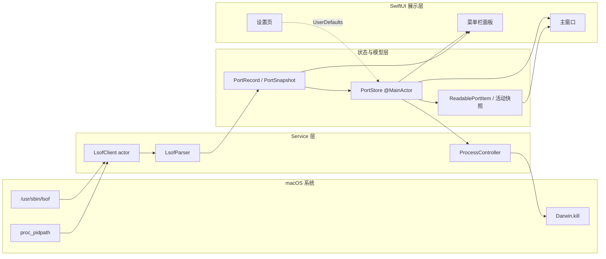
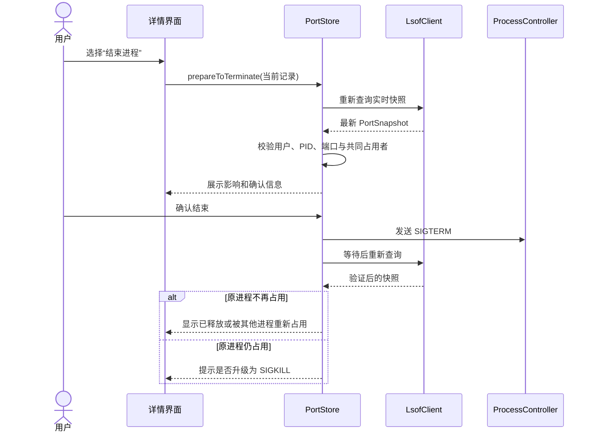

<div align="center">
  
  <h1>Port Viewer</h1>
  <p>一眼看懂端口被谁占用，以及应用正在进行什么网络活动。</p>

  <p>
    <a href="https://github.com/super-213/port-viewer/actions/workflows/xcode-build-analyze.yml"></a>
    
    
  </p>
</div>

Port Viewer 是一款使用 SwiftUI 构建的 macOS 原生端口查看工具。它把系统 `lsof` 返回的进程、端口和连接信息转换成更容易理解的中文结论，让不熟悉命令行的用户也能快速找到端口占用者，并在明确了解影响后结束对应进程。

所有查询都在本机完成，不需要账号，也不会把进程或网络连接数据上传到远端。

## 功能亮点

- **易懂的网络状态**：将 `LISTEN`、`ESTABLISHED` 等技术状态转换为“等待连接”“连接已建立”等中文说明。
- **连接关系可视化**：说明应用、本机端口与远端地址之间的关系，并区分“仅本机访问”和“同一网络可能访问”。
- **快速搜索与筛选**：按进程名、PID 或端口搜索，支持范围、访问来源、进程归属、协议、IP 版本和 TCP 状态筛选。
- **TCP 与 UDP 一并查看**：展示监听端口、已建立连接、连接变化和其他网络活动，同时保留完整技术字段。
- **菜单栏快捷入口**：无需打开主窗口即可查看概况、搜索记录、刷新数据或定位到详情。
- **自动刷新**：前台和后台可使用不同刷新间隔，也可暂停或手动刷新。
- **谨慎释放端口**：操作前重新确认进程仍在占用目标端口；优先发送 `SIGTERM`，必要时才提示使用 `SIGKILL`，操作后再次查询验证结果。
- **系统级使用体验**：支持浅色/深色外观、键盘快捷键和 VoiceOver 友好的文字说明。

## 系统要求

- macOS 15.0 或更高版本
- Xcode 16 或更高版本（持续集成使用 Xcode 16.4）
- 系统自带的 `/usr/sbin/lsof`

项目不依赖第三方 Swift Package。

## 快速开始

克隆仓库并打开 Xcode 项目：

```bash
git clone https://github.com/super-213/port-viewer.git
cd port-viewer
open PortViewer.xcodeproj
```

在 Xcode 中选择 `PortViewer` scheme 和 `My Mac`，然后按 `⌘R` 构建并运行。

也可以从命令行完成无签名构建：

```bash
xcodebuild \
  -project PortViewer.xcodeproj \
  -scheme PortViewer \
  -configuration Debug \
  -destination 'generic/platform=macOS' \
  CODE_SIGNING_ALLOWED=NO \
  build
```

## 使用方法

1. 启动应用后，Port Viewer 会自动读取当前 TCP/UDP 端口和连接。
2. 在搜索框输入进程名、PID 或端口号；输入 `:3000` 可只精确匹配端口 `3000`。
3. 从左侧选择“等待连接”“连接活动”或“其他活动”，也可以组合更多筛选条件。
4. 选择一条记录，查看易懂结论、连接关系、访问范围和可展开的技术详情。
5. 如需释放端口，选择“结束进程”并确认影响。应用会在发送信号前后分别校验一次实时状态。

常用快捷键：

| 快捷键 | 操作 |
|---|---|
| `⌘F` | 聚焦进程/端口搜索 |
| `⌘R` | 立即刷新 |
| `Esc` | 清空当前搜索 |

## 安全与隐私

- 端口信息来自本机 `/usr/sbin/lsof`，查询与解析均在本地执行。
- 应用不会执行用户输入的 Shell 命令，也不包含远程主机或公网端口扫描。
- 当前版本不申请管理员权限，只允许结束当前登录用户拥有的进程。
- 对 `launchd`、`kernel_task` 等关键系统进程禁用强制结束。
- “同一网络可能访问”仅根据监听地址推断，不代表端口已经暴露到公网；实际访问仍受防火墙和网络环境影响。
- 受 macOS 权限限制，部分其他用户或系统进程的信息可能不可见。

## 技术架构

项目采用轻量的 **MVVM + Service** 分层。`PortViewerApp` 创建唯一的 `PortStore`，主窗口、菜单栏和命令菜单共享这份状态；系统查询和进程操作集中在 Service 层，界面不直接执行系统命令。



> 图中的 `proc_pidpath` 用于补充可执行文件路径；`Darwin.kill` 仅在用户确认结束进程后调用。

### 分层职责

| 层级 | 主要文件 | 职责 |
|---|---|---|
| 应用入口 | [`PortViewerApp.swift`](PortViewer/PortViewerApp.swift) | 注册主窗口、`MenuBarExtra`、设置页和全局快捷命令，创建共享 `PortStore` |
| 展示层 | [`MainWindowView.swift`](PortViewer/Views/MainWindowView.swift)、[`MenuBarPanel.swift`](PortViewer/Views/MenuBarPanel.swift)、[`SettingsView.swift`](PortViewer/Views/SettingsView.swift) | 列表、筛选、连接关系图、技术详情、菜单栏和刷新设置 |
| 状态层 | [`PortStore.swift`](PortViewer/ViewModels/PortStore.swift) | 管理查询状态、自动刷新、快照、连接变化、选择联动、结束进程确认与反馈 |
| 展示模型 | [`NetworkPresentation.swift`](PortViewer/Models/NetworkPresentation.swift) | 将原始网络记录归组，生成中文状态、访问范围、连接结论和活动变化 |
| 数据模型 | [`PortRecord.swift`](PortViewer/Models/PortRecord.swift) | 定义原始端口记录、查询快照、端点格式和搜索匹配规则 |
| 查询服务 | [`LsofClient.swift`](PortViewer/Services/LsofClient.swift)、[`LsofParser.swift`](PortViewer/Services/LsofParser.swift) | 执行限时 `lsof` 查询、读取输出、解析字段并补充进程路径 |
| 进程服务 | [`ProcessController.swift`](PortViewer/Services/ProcessController.swift) | 发送 `SIGTERM`/`SIGKILL`、检查进程是否存在并保护关键系统进程 |

### 查询与刷新数据流

1. `PortStore.start()` 触发首次查询，并启动自动刷新循环。
2. `LsofClient` 以 actor 隔离查询入口，再通过 utility 优先级的后台任务执行 `/usr/sbin/lsof -nP -iTCP -iUDP -F0pcuLRftnPT`。
3. `LsofParser` 解析 NUL 分隔字段，生成稳定标识的 `PortRecord`；随后使用 `proc_pidpath` 尽可能补充可执行文件路径。
4. 查询结果以完整 `PortSnapshot` 返回，并在 `@MainActor` 的 `PortStore` 中一次性发布，避免列表逐行跳动。
5. `ReadablePortItem` 按进程、协议、端口、状态含义、访问范围和远端端点归组，在不丢失原始记录的前提下生成易懂结论。
6. 主窗口在内存快照上完成搜索、筛选和排序，用户每次输入字符时不会重新执行 `lsof`。

刷新机制的关键约束：

- 主窗口可见时默认每 3 秒刷新，后台默认每 5 秒刷新，可在设置页调整。
- 单次查询最多等待 5 秒；同一时间只允许一个查询运行。
- 自动刷新不会堆积；查询期间收到的手动刷新会合并为下一次查询。
- 完整查询失败时保留上一份快照和最后成功时间；部分结果会明确标记，不会被当作完整结果用于危险操作。
- 每次快照会与上次结果比较，短暂展示监听端口中新出现、结束或变化的连接活动。

### 核心数据模型

| 类型 | 作用 |
|---|---|
| `PortRecord` | 一条未经简化的 TCP/UDP 记录，包含进程、PID、用户、文件描述符、协议、地址、端口和状态 |
| `PortSnapshot` | 一次查询的原子结果，附带采集时间、耗时和“结果是否不完整”标记 |
| `QueryPresentationState` | 区分加载、正常、空数据、暂停、部分结果、失败和 `lsof` 不可用等界面状态 |
| `ReadablePortItem` | 面向用户的归组记录，保存全部原始记录，并提供中文结论、状态与访问范围 |
| `PortActivitySnapshot` | 记录监听端口对应的连接标识和远端端点，用于计算两次刷新之间的变化 |
| `TerminationPrompt` | 保存普通/强制结束阶段、目标记录、其他连接、共同占用者和关键进程标记 |

### 结束进程时序

结束端口占用者不是直接执行 `kill`。应用会重新查询实时状态、校验进程归属并让用户确认，之后再验证操作结果。



关键系统进程禁止强制结束；其他用户拥有的进程不会被操作；如果操作前查询不完整，则不会发送任何信号。

## 项目结构

```text
port-viewer/
├── .github/workflows/
│   └── xcode-build-analyze.yml     # GitHub Actions 构建与静态分析
├── PortViewer/
│   ├── Models/
│   │   ├── PortRecord.swift        # 原始端口模型与搜索
│   │   └── NetworkPresentation.swift # 易懂化模型与连接变化
│   ├── Services/
│   │   ├── LsofClient.swift        # 查询执行、超时和进程元数据
│   │   ├── LsofParser.swift        # lsof 机器输出解析
│   │   └── ProcessController.swift # 信号发送与关键进程保护
│   ├── ViewModels/
│   │   └── PortStore.swift         # 全局状态与业务流程
│   ├── Views/
│   │   ├── MainWindowView.swift    # 主窗口与连接关系详情
│   │   ├── MenuBarPanel.swift      # 菜单栏面板
│   │   └── SettingsView.swift      # 刷新和菜单栏设置
│   ├── Assets.xcassets/
│   └── PortViewerApp.swift         # 应用入口
├── PortViewerTests/                # 单元测试与真实 lsof 集成测试
├── docs/                           # 产品需求文档
└── PortViewer.xcodeproj/
```

## 测试与持续集成

运行全部单元测试和本机 `lsof` 集成测试：

```bash
xcodebuild \
  -project PortViewer.xcodeproj \
  -scheme PortViewer \
  -destination 'platform=macOS' \
  CODE_SIGNING_ALLOWED=NO \
  test
```

| 测试文件 | 覆盖范围 |
|---|---|
| [`LsofParserTests.swift`](PortViewerTests/LsofParserTests.swift) | 进程/文件字段、IPv4/IPv6 端点和异常字段解析 |
| [`PortSearchTests.swift`](PortViewerTests/PortSearchTests.swift) | 端口、PID、进程名搜索和精确匹配排序 |
| [`NetworkPresentationTests.swift`](PortViewerTests/NetworkPresentationTests.swift) | 中文状态、访问范围、记录归组、连接活动变化和数据表述边界 |
| [`LsofClientIntegrationTests.swift`](PortViewerTests/LsofClientIntegrationTests.swift) | 在真实 macOS 环境中执行 `lsof` 并校验快照 |

GitHub Actions 会在推送或向 `main` 分支提交 Pull Request 时，使用 Xcode 16.4 执行 clean、build 和 analyze。工作流定义见 [`xcode-build-analyze.yml`](.github/workflows/xcode-build-analyze.yml)。

## 开发扩展指引

- **新增 `lsof` 字段**：依次更新 `LsofParser`、`PortRecord`、需要的展示模型，并在 `LsofParserTests` 增加输入样本。
- **新增状态或易懂文案**：集中修改 `NetworkPresentation.swift`，同时补充 `NetworkPresentationTests`，避免技术状态与用户结论散落在视图中。
- **新增筛选项**：优先在现有快照上实现，不要让界面输入直接触发新的系统查询。
- **修改进程结束策略**：保持“操作前复查—确认—发送信号—操作后验证”的安全链路，并继续通过 `ProcessProtectionPolicy` 保护关键进程。

## 相关文档

- [产品需求文档](docs/requirements.md)
- [易懂化与图形化改版需求](docs/beginner-friendly-visualization-prd.md)

## 参与开发

欢迎提交 Issue 或 Pull Request。修改行为逻辑时，请同步补充或更新 `PortViewerTests` 中的测试，并确保本地构建和测试通过。
