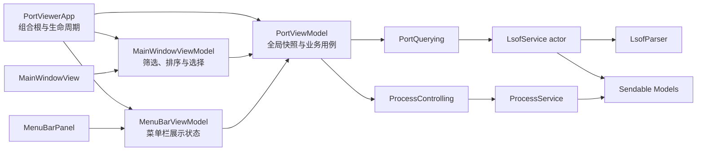
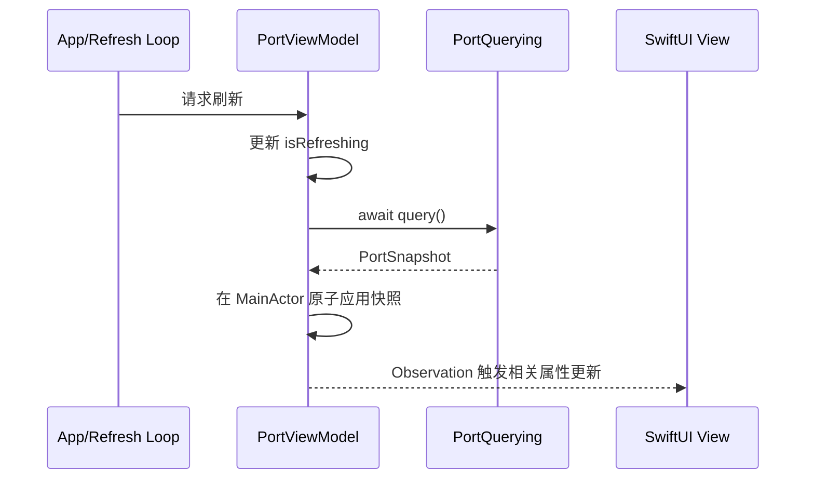

# Port Viewer 架构重构需求文档

> 文档版本：v0.1（已确认）  
> 文档状态：草案，需完成“待确认事项”后再实施  
> 创建日期：2026-07-22  
> 重构目标：MVVM + Service + Observation + Swift Concurrency  
> 默认原则：保持现有产品功能、界面和用户数据不变，仅重构代码结构与并发实现

## 1. 文档目的

本文档定义 Port Viewer 从当前的“Store-based MVVM + Service + Combine Observation + Swift Concurrency/GCD 混合实现”迁移到以下目标架构的范围、职责边界、实施顺序和验收标准：

- 使用明确的 MVVM 分层承载界面状态和展示逻辑；
- 使用协议化 Service 隔离系统能力和外部副作用；
- 使用 Observation 框架的 `@Observable` 管理可观察状态；
- 使用 Swift Concurrency 管理异步查询、自动刷新、取消、超时和主线程隔离；
- 保持现有端口查询、搜索筛选、菜单栏、自动刷新和结束进程功能行为一致。

本文档是实施前的需求基线，不包含代码修改。所有标记为 **[待确认]** 的内容需要在开始重构前由维护者手动确认或修改。

## 2. 当前架构概况

### 2.1 当前已有能力

| 领域 | 当前实现 |
|---|---|
| 数据模型 | `PortRecord`、`PortSnapshot`、`ReadablePortItem` 等值类型，大部分已声明 `Sendable` |
| 状态容器 | `@MainActor final class PortStore: ObservableObject` |
| 状态发布 | `@Published`、`@StateObject`、`@ObservedObject` |
| 查询服务 | `actor LsofClient` 执行并解析 `lsof` 查询 |
| 进程服务 | `ProcessController` 执行进程检查与信号发送 |
| 并发 | `async/await`、`Task`、`Task.detached`、`actor`、`@MainActor`，同时混用 GCD、锁和 `usleep` |
| 展示逻辑 | 一部分位于 `PortStore` 和模型扩展，一部分直接位于 `MainWindowView`、`MenuBarPanel` |

### 2.2 当前主要问题

1. `PortStore` 使用 Combine 的 `ObservableObject/@Published`，不是 Observation 框架。
2. `MainWindowView` 同时承担视图渲染、筛选、排序、搜索、选择恢复和过期选择清理，职责较重。
3. `PortStore` 同时承担全局状态、刷新调度、查询编排、进程结束用例和部分展示逻辑，边界偏宽。
4. Service 通过具体类型注入，缺少可替换协议，不利于 ViewModel 单元测试。
5. `LsofClient` 虽然是 actor，但内部仍使用 `DispatchQueue.global`、`NSLock`、`usleep` 和阻塞等待。
6. actor 在 `await` 时允许重入，当前 `LsofClient` 本身没有明确的 single-flight 状态，不能独立保证底层只运行一个 `lsof` 进程。
7. 项目使用 Swift 5 语言模式，未显式启用完整严格并发检查。

## 3. 重构目标

### 3.1 必须达到的目标

1. View 只负责布局、视觉状态绑定、用户事件转发和必要的纯 UI 临时状态。
2. ViewModel 负责页面状态、派生展示数据、搜索筛选、选择状态和业务用例编排。
3. Service 负责 `lsof` 查询、解析、进程元数据和进程信号等系统副作用。
4. ViewModel 使用 Observation 框架，不再依赖 `ObservableObject/@Published`。
5. 所有 UI 可观察状态都在 `@MainActor` 上读写。
6. Service 的异步边界使用 `async/await`，支持超时、取消和错误传递。
7. 同一时间最多执行一次底层 `lsof` 查询；重复刷新不得堆积系统进程。
8. 数据模型和跨隔离域传递的数据满足 `Sendable` 要求。
9. 重构后现有功能、默认刷新周期、错误文案和安全策略保持一致，除非待确认事项另有决定。
10. 核心 ViewModel 和 Service 可以使用 Fake/Stub 进行确定性单元测试。

### 3.2 期望达到的目标

1. 减少不相关状态变化导致的视图失效和重复派生计算。
2. 让刷新循环、手动刷新、进程结束前后复查等流程具备清晰的任务所有权。
3. 使主窗口和菜单栏对同一查询快照保持一致，同时允许各自拥有独立的页面状态。
4. 为未来的关注端口、通知和历史记录功能提供稳定扩展点。

### 3.3 非目标

本轮重构默认不包含：

- 修改现有 UI 视觉设计或交互流程；
- 新增远程扫描、历史记录、收藏、通知或导出功能；
- 改变 `lsof` 查询字段和数据含义；
- 引入第三方依赖注入、响应式或并发框架；
- 修改进程终止安全策略；
- 为降低资源占用而主动调整默认刷新频率；
- 将项目改造成多模块 Swift Package。

## 4. 目标架构



如果最终决定不增加页面级 ViewModel，可将 `MainWindowViewModel` 和 `MenuBarViewModel` 的职责保留在 View 中；该选择必须在第 12 节确认。

### 4.1 分层职责

| 层级 | 允许承担的职责 | 不应承担的职责 |
|---|---|---|
| View | 布局、动画、焦点、展示绑定、转发事件 | 执行系统查询、进程控制、复杂筛选排序、业务状态机 |
| ViewModel | 可观察状态、展示数据、用例编排、错误映射、任务生命周期 | 直接创建 `Process`、调用 `kill`、解析原始 `lsof` 数据 |
| Service | 系统能力、异步 I/O、超时、取消、数据采集 | SwiftUI 状态、弹窗文案、视图选择状态 |
| Model | 领域数据、无副作用的格式化、纯计算规则 | 持有 Task、访问 SwiftUI、执行系统命令 |

## 5. MVVM 重构需求

### MVVM-001：全局 ViewModel

将 `PortStore` 重命名或重构为全局 `PortViewModel`，至少负责：

- 当前 `PortSnapshot` 或记录集合；
- 查询展示状态；
- 最近成功更新时间和查询耗时；
- 自动刷新、暂停和手动刷新；
- 监听端口变化反馈；
- 结束进程前校验、用户确认状态、信号发送后的验证；
- 面向主窗口和菜单栏共享的统计信息。

`PortViewModel` 必须标记为 `@MainActor` 和 `@Observable`。

### MVVM-002：页面级 ViewModel

建议新增 `MainWindowViewModel`，负责：

- 搜索文本和所有筛选条件；
- 排序规则；
- `ReadablePortItem` 分组和派生列表；
- 当前选中项、刷新后的选中项恢复、失效选择和替代占用者；
- 清除搜索、重置筛选、处理菜单栏定位请求。

建议新增 `MenuBarViewModel`，负责：

- 菜单栏搜索文本；
- 监听端口排序和最多展示条数；
- 菜单栏专用的更新时间与空状态描述。

页面级 ViewModel 不得直接调用 `LsofService` 或 `ProcessService`，需要通过全局 `PortViewModel` 发起业务操作。

### MVVM-003：View 状态边界

以下状态可以继续留在 View：

- `FocusState`；
- 纯视觉动画开关；
- popover、help、局部展开/折叠等不影响业务结果的短生命周期状态。

以下状态应迁移到页面级 ViewModel：

- 搜索、筛选和排序；
- 业务选择项及跨刷新恢复规则；
- 基于记录集合计算的展示列表；
- 会影响多个子视图或需要测试的状态转换。

### MVVM-004：依赖注入

应用入口作为组合根创建正式 Service 和 ViewModel，并显式注入依赖。ViewModel 内不得通过默认参数或全局单例隐式创建生产 Service，测试 Preview 可使用专用 Factory 或 Fake。

## 6. Observation 重构需求

### OBS-001：状态系统迁移

生产代码必须移除以下用于业务 ViewModel 的 Combine 观察方式：

- `ObservableObject`；
- `@Published`；
- `@StateObject`；
- `@ObservedObject`。

目标方式：

```swift
import Observation

@MainActor
@Observable
final class PortViewModel {
    private(set) var records: [PortRecord] = []
    var terminationPrompt: TerminationPrompt?
}
```

### OBS-002：SwiftUI 所有权

- 应用入口使用 `@State` 持有 `@Observable` 引用类型实例。
- 子视图通过普通属性接收 ViewModel。
- 只有需要生成属性 Binding 的视图使用 `@Bindable`。
- 不得同时对同一个 ViewModel 使用 Combine 和 Observation 双重发布。

### OBS-003：细粒度依赖

视图应只读取自己实际展示的 ViewModel 属性。不得为了传递方便让所有子视图都读取整个状态对象，从而抵消 Observation 的细粒度追踪收益。

### OBS-004：Observation 忽略项

Task 句柄、Service 引用、缓存实现和其他不应触发界面更新的内部属性应按需使用 `@ObservationIgnored`。使用前应确认宏是否已经自动忽略不可观察或私有实现属性，避免无意义标记。

## 7. Service 重构需求

### SVC-001：查询协议

定义可替换的查询协议，建议接口：

```swift
protocol PortQuerying: Sendable {
    func query() async throws -> PortSnapshot
}
```

生产实现建议命名为 `LsofService`；如果保留 `LsofClient` 名称，其职责和协议要求不变。

### SVC-002：进程控制协议

定义可替换的进程控制协议，至少覆盖：

- 判断 PID 是否存在；
- 发送 `SIGTERM`；
- 发送 `SIGKILL`；
- 将系统错误转换为稳定的领域错误。

ViewModel 不应直接调用 `Darwin.kill`。

### SVC-003：解析职责

`LsofParser` 保持无状态、无副作用、`Sendable` 和可独立测试。解析失败、部分输出和空结果的语义必须与当前实现一致。

### SVC-004：系统元数据

`proc_pidpath` 等系统元数据查询保留在 Service 层。是否单独拆分为 `ProcessMetadataProviding` 由第 12 节决定。

### SVC-005：错误边界

- Service 返回领域错误或可稳定映射的错误类型；
- ViewModel 负责把错误转换为页面展示状态和用户文案；
- View 不得判断 `errno`、进程退出码或 `lsof` 状态码。

## 8. Swift Concurrency 重构需求

### CON-001：隔离规则

- 所有可观察 ViewModel 使用 `@MainActor`；
- 查询 Service 使用 actor 或其他明确的并发安全实现；
- 跨 actor 传递的模型必须满足 `Sendable`；
- 禁止用 `@unchecked Sendable` 掩盖未经说明的数据竞争；如确需使用，必须附带线程安全依据和测试。

### CON-002：查询 single-flight

Service 必须保证同一时刻最多存在一个底层 `lsof` 进程。

- 同时到达的兼容查询请求应复用正在执行的查询；
- 自动刷新不得无限排队；
- 查询中到达的手动刷新最多合并为一次后续刷新；
- 进程结束前/后的安全复查不得错误复用已过期快照。

最后一项可能与普通刷新复用策略冲突，需要为查询增加“允许复用/必须新查询”语义，详见第 12 节。

### CON-003：任务所有权

每个长期 Task 必须有明确所有者和取消时机：

| Task | 建议所有者 | 取消时机 |
|---|---|---|
| 自动刷新循环 | `PortViewModel` 或 App 生命周期 | 应用退出或 ViewModel 销毁 |
| 单次查询 | 查询 Service | 完成、超时或明确取消 |
| 活动提示清理 | `PortViewModel` | 新任务替换、ViewModel 销毁 |
| 失效选择延迟清理 | `MainWindowViewModel` | 选择恢复、选择改变或 ViewModel 销毁 |
| 进程终止后复查 | `PortViewModel` | 完成、用户取消或 ViewModel 销毁 |

禁止创建无人持有、无法取消且会修改业务状态的 fire-and-forget Task。

### CON-004：超时和休眠

- 使用 `Task.sleep(for:)` 或等效的可取消 Swift Concurrency API；
- 不再使用 `usleep` 轮询进程状态；
- 查询超时必须终止底层进程并等待资源释放；
- 超时路径不得遗留 Pipe reader、文件句柄或子进程。

### CON-005：Process 异步桥接

`Process` 和 Pipe 的完成、输出读取应封装为异步接口。目标实现不得在应用自建的串行 actor 上长期执行以下阻塞操作：

- `waitUntilExit()`；
- `DispatchGroup.wait()`；
- 轮询 `Process.isRunning`；
- 为等待进程退出而持续占用主线程。

若 Foundation API 必须使用短时间阻塞桥接，可以放入隔离的后台执行器，但必须说明原因、保证取消和超时，并通过测试确认没有重复查询或资源泄漏。

### CON-006：严格并发检查

第一阶段建议保持 Swift 5 语言模式，显式启用完整严格并发检查并消除警告；第二阶段再决定是否切换 Swift 6 语言模式。

构建应至少验证：

- `SWIFT_STRICT_CONCURRENCY = complete`；
- 不新增数据竞争和 actor 隔离警告；
- 不使用无依据的 `nonisolated(unsafe)` 或 `@unchecked Sendable`。

## 9. 状态和数据流需求

### 9.1 正常刷新



### 9.2 进程结束

必须保留当前安全链路：

1. 检查记录是否属于当前用户；
2. 强制执行一次新查询，确认 PID、端口和进程身份仍匹配；
3. 部分查询结果不得用于危险操作；
4. 展示结束整个进程的影响和共同占用者；
5. 用户确认后发送 `SIGTERM`；
6. 等待后强制执行一次新查询验证结果；
7. 如仍占用，可进入 `SIGKILL` 二次确认；
8. 关键系统进程禁止强制结束；
9. 根据最新快照报告“已释放、被重新占用、仍占用或无法验证”。

### 9.3 状态一致性

- 主窗口和菜单栏共享同一个全局查询快照；
- 两个界面可以拥有独立的搜索、筛选、选择和局部 UI 状态；
- 应用新快照时必须一次性更新记录、采集时间、查询耗时和结果完整性；
- 查询失败不得清空上一份成功快照；
- 部分结果不得错误地产生“连接已经结束”的活动结论。

## 10. 建议文件结构

```text
PortViewer/
├── App/
│   └── PortViewerApp.swift
├── Models/
│   ├── PortRecord.swift
│   ├── PortSnapshot.swift
│   └── NetworkPresentation.swift
├── Services/
│   ├── PortQuerying.swift
│   ├── LsofService.swift
│   ├── LsofParser.swift
│   ├── ProcessControlling.swift
│   └── ProcessService.swift
├── ViewModels/
│   ├── PortViewModel.swift
│   ├── MainWindowViewModel.swift
│   └── MenuBarViewModel.swift
└── Views/
    ├── MainWindowView.swift
    ├── MenuBarPanel.swift
    └── SettingsView.swift
```

目录调整不是独立目标。如果大规模移动文件会增加审查成本，可以保持现有目录，仅新增协议和 ViewModel 文件。

## 11. 实施顺序

### 阶段 1：建立安全基线

1. 保证当前测试全部通过并记录基线；
2. 为 `PortStore` 的刷新、错误、暂停和结束进程流程补充行为测试；
3. 为并发重复刷新和 single-flight 补充失败测试；
4. 开启严格并发检查，记录现有警告。

### 阶段 2：Service 协议化

1. 新增 `PortQuerying` 和 `ProcessControlling`；
2. 让现有生产 Service 遵循协议；
3. 添加 Fake Service；
4. 将 ViewModel 依赖改为协议注入；
5. 确保功能行为不变。

### 阶段 3：迁移 Observation

1. 将 `PortStore` 重命名或转换为 `@Observable` ViewModel；
2. 将应用入口的 `@StateObject` 改为 `@State`；
3. 将子视图的 `@ObservedObject` 改为普通属性或局部 `@Bindable`；
4. 移除 `@Published` 和不再需要的 Combine 依赖；
5. 验证弹窗、反馈栏、菜单栏状态和命令菜单仍会更新。

### 阶段 4：提取页面展示逻辑

1. 提取主窗口筛选、排序和选择状态；
2. 提取菜单栏派生记录；
3. 避免 `body` 更新时无条件重复执行昂贵分组；
4. 为页面级 ViewModel 添加纯状态测试。

### 阶段 5：并发实现收敛

1. 实现查询 single-flight；
2. 将 `Process` 生命周期包装为可取消异步操作；
3. 移除 `usleep` 轮询和不必要的 GCD/锁；
4. 验证超时、取消、部分结果和进程退出路径；
5. 消除严格并发警告。

### 阶段 6：回归与清理

1. 运行单元测试、集成测试、build 和 analyze；
2. 使用 Instruments 比较重构前后的 CPU、内存、线程和能耗；
3. 更新 README 架构说明；
4. 删除不再使用的 Store、Combine 和兼容代码。

每个阶段应保持项目可构建、可测试，避免一次性同时迁移状态系统、并发底层和全部 View。

## 12. 待确认事项

实施前请手动编辑“最终决定”列。未填写时，实施者不得自行扩大重构范围。

| 编号 | 歧义/决策 | 建议默认值 | 影响 | 最终决定 |
|---|---|---|---|---|
| D-001 | `PortStore` 是否重命名 | 重命名为 `PortViewModel`，明确 MVVM 语义 | 文件名、类型名和测试需要同步修改 | **[已确认]** |
| D-002 | 是否新增页面级 ViewModel | 新增 `MainWindowViewModel` 和 `MenuBarViewModel` | 可测试性更好，但类型和注入关系增加 | **[已确认]** |
| D-003 | 页面级 ViewModel 如何读取全局状态 | 由 App 组合并持有对 `PortViewModel` 的引用 | 实现简单，但需要注意 Observation 依赖追踪 | **[已确认]** |
| D-004 | 是否拆分 `ProcessMetadataProviding` | 本轮不拆，保留在查询 Service 内 | 少一个抽象；未来独立缓存时再拆 | **[已确认]** |
| D-005 | `ProcessControlling` 接口同步还是异步 | `kill`/存在性检查保持同步，调用前后复查保持异步 | 系统调用很短；全异步接口形式更统一但收益有限 | **[已确认]** |
| D-006 | 普通刷新是否复用正在执行的查询 | 是，普通请求复用；危险操作复查强制新查询 | 兼顾资源占用与安全新鲜度 | **[已确认]** |
| D-007 | 等待者取消是否取消共享查询 | 单个等待者取消不终止共享查询；应用退出或超时才终止 | 避免一个界面取消影响其他消费者，实现更复杂 | **[已确认]** |
| D-008 | 自动刷新 Task 由谁持有 | 全局 `PortViewModel` 持有，App 生命周期控制 | 与当前常驻菜单栏行为一致 | **[已确认]** |
| D-009 | 是否调整默认刷新间隔 | 不调整，保持前台 3 秒、后台 5 秒 | 本轮专注架构，不混入产品行为变化 | **[已确认]** |
| D-010 | 是否迁移 Swift 6 语言模式 | 本轮先开启严格并发检查，后续单独迁移 Swift 6 | 降低一次性编译错误和行为变化风险 | **[已确认]** |
| D-011 | 是否彻底移除 Service 内的 GCD/锁 | 尽量移除；Foundation 桥接确需使用时允许局部保留并说明 | 彻底异步化实现复杂度较高 | **[已确认]** |
| D-012 | 最低系统版本是否保持 macOS 15 | 保持 macOS 15 | Observation 和异步 API 可直接使用 | **[已确认]** |
| D-013 | 是否允许调整现有用户文案 | 不允许，除非为了错误边界必须修改且单独评审 | 影响 UI 回归范围 | **[已确认]** |
| D-014 | 是否在本轮做性能优化 | 只消除重复派生计算和重复查询，不调整产品策略 | 避免把架构重构扩大为完整性能项目 | **[已确认]** |
| D-015 | 是否移动现有文件和目录 | 只新增必要文件，不做纯目录整理 | 减少 diff 和 Xcode 工程冲突 | **[已确认]** |
| D-016 | Preview 和测试如何创建依赖 | 使用显式 Fake Factory，不在 ViewModel 默认参数中创建生产 Service | 依赖关系最清晰 | **[已确认]** |

## 13. 测试需求

### 13.1 ViewModel 测试

至少覆盖：

- 首次查询成功、空结果、失败、不可用和部分结果；
- 手动刷新期间的重复请求合并；
- 暂停和恢复自动刷新；
- 查询失败时保留上一份成功数据；
- 快照活动变化与过期清理；
- 搜索、筛选、排序及组合条件；
- 刷新后的选择恢复、失效选择和替代占用者；
- 结束其他用户进程被拒绝；
- 操作前记录消失、端口迁移和部分结果；
- `SIGTERM` 成功、仍占用后升级确认、`SIGKILL` 禁止关键进程；
- 信号发送后查询失败时不误报成功。

### 13.2 Service 测试

至少覆盖：

- `lsof` 正常输出、空输出、部分输出、非零退出和无法解析；
- 查询超时后子进程和 Pipe 被清理；
- 取消查询后不遗留子进程；
- 并发调用最多启动一个兼容查询；
- 危险操作要求的新查询不会错误返回旧快照；
- 进程控制错误映射保持稳定；
- 现有真实 `lsof` 集成测试继续通过。

### 13.3 UI 和集成回归

- 主窗口和菜单栏显示同一份最新快照；
- `Command-R`、暂停/恢复、搜索聚焦继续工作；
- 弹窗 Binding 在 Observation 迁移后正常展示和关闭；
- 主窗口关闭后菜单栏继续刷新；
- 应用退出后不存在残留查询任务或 `lsof` 子进程。

## 14. 性能与资源验收

架构迁移不承诺必然降低资源占用，但不得产生明显回退。应在相同记录规模和刷新周期下比较：

- 空闲状态平均 CPU；
- 一次刷新期间峰值 CPU；
- 常驻内存；
- 活跃线程数量；
- 同时存在的 `lsof` 子进程数量；
- 主窗口筛选和搜索时的响应延迟；
- 主窗口关闭、仅菜单栏运行时的能耗。

最低验收要求：

1. 任意时刻底层 `lsof` 子进程不超过 1 个；危险操作的强制新查询必须等待或替换旧查询，而不是并行启动第二个进程。
2. 主线程不执行 `lsof`、Pipe 阻塞读取、等待子进程或大批量解析。
3. 相同场景下不得出现稳定可复现的 CPU、内存或线程数量明显回退。
4. Observation 迁移后，菜单栏局部状态变化不应无条件重算主窗口全部派生数据。

## 15. 完成定义

只有同时满足以下条件，重构才视为完成：

- [ ] 第 12 节所有待确认事项已经填写；
- [ ] ViewModel 已使用 Observation，不再使用业务层 `ObservableObject/@Published`；
- [ ] View 不直接访问生产 Service；
- [ ] 查询和进程控制通过协议注入；
- [ ] UI 状态满足 `@MainActor` 隔离；
- [ ] 跨隔离数据满足 `Sendable`；
- [ ] 查询具备 single-flight、超时、取消和资源清理；
- [ ] 长期 Task 具有明确所有权和取消路径；
- [ ] 严格并发检查没有新增警告；
- [ ] 现有测试和新增架构测试全部通过；
- [ ] build、test 和 analyze 全部通过；
- [ ] 关键产品行为与安全链路完成回归；
- [ ] README 已更新为实际落地后的架构说明。

## 16. 实施约束

1. 重构过程中不得降低结束进程操作的安全校验。
2. 不得为了消除编译错误而大量添加 `@unchecked Sendable`、`nonisolated(unsafe)` 或忽略 actor 隔离。
3. 不得让 ViewModel 或 View 直接依赖 `Process`、Pipe、Darwin 错误码等底层细节。
4. 不得以延长超时或吞掉取消错误掩盖异步资源清理问题。
5. 每个实施阶段应产生可审查、可回滚且测试通过的独立变更。
6. 如果实施过程中发现需要改变 UI、刷新策略或安全行为，应先更新本文档的待确认事项，再修改代码。
